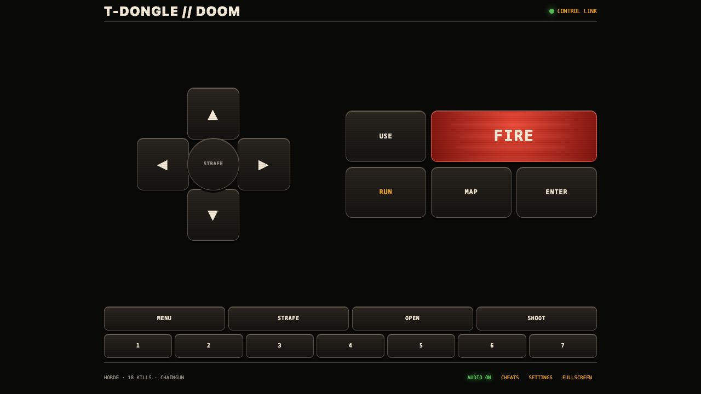

# DOOM for the LilyGO T-Dongle-S3

[](https://github.com/pzzzy/t-dongle-s3-doom/actions/workflows/ci.yml)
[](https://github.com/pzzzy/t-dongle-s3-doom/releases/latest)
[](LICENSE)

Native DOOM on a $20 ESP32-S3 USB dongle: a 160×80 color display, the original
35 Hz game clock, a phone-first Wi-Fi controller, positional sound and OPL2
music through the browser, and an absurdly satisfying one-button horde mode.



## Highlights

- Native Chocolate/PicoDoom-derived engine on the ESP32-S3—not video streaming.
- 160×80 ST7735 LCD output with a scaled playfield, complete status bar, weapon
  sprites, menus, messages, palette effects, demos, and stable 35 Hz timing.
- Single-button fidget mode: one press opens a custom arena; every later press
  fires into an infinite, front-facing horde.
- Invulnerability, infinite ammo, all weapons, and kill-driven progression from
  pistol to BFG while retaining real DOOM combat and monster logic.
- Responsive phone controller at `http://192.168.4.1/`, designed around iPhone
  safe areas, 44-point touch targets, cancellation safety, input leases, and
  acknowledged WebSocket frames.
- Authentic SFX semantics and Bobby Prince/DMX-style OPL2 music played through
  Web Audio on the phone, tablet, or computer connected to the dongle.
- Optional USB-host keyboard/gamepad build path and saved display rotation.

The current release is **v1.4.0**. On the reference T-Dongle-S3 it holds the
native game at 35 Hz; the one-button stress test advanced through chaingun with
no heap loss, and eight real browser reloads restored controls in 136–300 ms.

## What you need

- LilyGO T-Dongle-S3 with its 160×80 ST7735 display and 16 MB flash.
- A legally obtained registered DOOM IWAD containing E3M9. The project was
  developed with the registered `DOOM1.WAD`.
- Python 3.10+, `esptool`, and a locally built `whd_gen`.
- For browser music: `mus2mid`, libADLMIDI's `adlmidiplay`, and FFmpeg/ffprobe.

> [!IMPORTANT]
> This repository and its releases contain no commercial DOOM game data. You
> must supply your own IWAD. Do not open an issue asking for WAD, WHD, or audio
> pack downloads.

## Install a release

Download `tdongle-doom-1.4.0-firmware.zip` from the [latest
release](https://github.com/pzzzy/t-dongle-s3-doom/releases/latest), extract it,
then generate the private flash assets and install them:

```sh
python -m pip install esptool

python tools/flash_tdongle.py /path/to/DOOM1.WAD \
  --port /dev/cu.usbmodem1101 \
  --firmware-dir /path/to/extracted-firmware \
  --whd-gen ./build-native/src/whd_gen/whd_gen
```

That command creates a temporary copy of your IWAD with the fidget arena in
E3M9, converts it to the low-memory WHD format, verifies every partition limit,
and flashes bootloader, partition table, application, and WHD. Nothing from the
IWAD is uploaded anywhere.

To include phone-speaker audio, first build a private audio pack:

```sh
python tools/build_web_audio_pack.py /path/to/DOOM1.WAD doom-audio.pack \
  --manifest doom-audio.json

python tools/flash_tdongle.py /path/to/DOOM1.WAD \
  --port /dev/cu.usbmodem1101 \
  --firmware-dir /path/to/extracted-firmware \
  --whd-gen ./build-native/src/whd_gen/whd_gen \
  --audio-pack ./doom-audio.pack
```

The default Wi-Fi network is `T-Dongle-DOOM-XXXX`, where `XXXX` comes from the
device MAC. Its password is `ripandtear`; open `http://192.168.4.1/` after
joining. Tap **AUDIO** once to satisfy mobile browser autoplay rules.

## Play the one-button horde

Power the dongle normally and press its physical button once. The game replaces
the current demo with the custom arena. From then on, tap or hold the button to
fire. Weapon rewards arrive at 4, 12, 28, 52, and 84 kills.

The horde is infinite but memory-bounded: eight monster slots are recycled,
only six can be alive simultaneously, and completed corpses are reclaimed.
See [the fidget-mode design](esp-idf/FIDGET_MODE.md) for the engine hooks and
invariants.

## Build from source

ESP-IDF 5.3.x is supported; v5.3.5 is used by CI and the release build.

```sh
git clone --recurse-submodules https://github.com/pzzzy/t-dongle-s3-doom.git
cd t-dongle-s3-doom

. /path/to/esp-idf/export.sh
idf.py -C esp-idf build
```

The firmware build does not embed a WAD or audio pack. Build `whd_gen` using
the native CMake build inherited from RP2040 Doom (SDL2 development libraries
are required):

```sh
cmake -S . -B build-native -DCMAKE_BUILD_TYPE=Release
cmake --build build-native --target whd_gen mus2mid -j
```

The flash map is fixed and checked by `tools/flash_tdongle.py`:

| Offset | Partition | Contents |
|---:|---|---|
| `0x000000` | bootloader | ESP-IDF bootloader |
| `0x008000` | partition table | 16 MB layout |
| `0x010000` | app | native engine and web controller |
| `0x120000` | storage | user-generated WHD |
| `0x6DA000` | audio | optional user-generated DWAP bank |

## Architecture and documentation

- [One-button fidget mode](esp-idf/FIDGET_MODE.md)
- [Browser audio and acknowledged control protocol](esp-idf/WEB_AUDIO.md)
- [Original RP2040 port documentation](README-RP2040.md)
- [Chocolate Doom background](README-chocolate.md)

The project began with Graham Sanderson's remarkable RP2040 Doom port, itself
derived from Chocolate Doom and id Software's released DOOM source. The ESP32-S3
backend, low-resolution renderer, input broker, web control/audio system, and
fidget arena are maintained here. Trademark and game-data rights remain with
their respective owners; this project is not affiliated with id Software,
Bethesda, ZeniMax, LilyGO, or Espressif.

## Contributing and security

Contributions are welcome—start with [CONTRIBUTING.md](CONTRIBUTING.md). Please
use the issue forms for reproducible bugs and feature proposals. For a security
issue, follow [SECURITY.md](SECURITY.md) and use GitHub's private vulnerability
reporting instead of a public issue.

Most engine-derived code is licensed under GPL-2.0-or-later; independently
licensed upstream components retain their original terms. See [LICENSE](LICENSE)
and the notices in the source tree.
